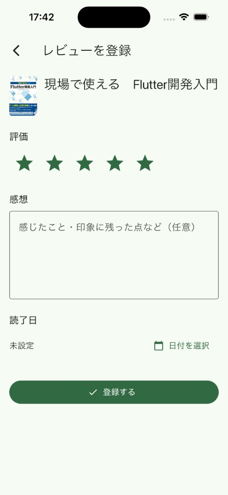
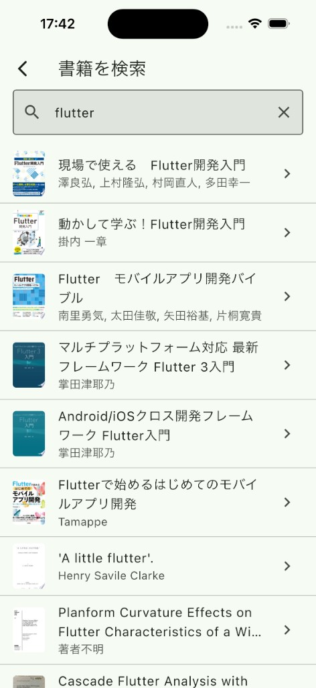

# 読書レビュー管理アプリ（book_review）


## アプリ概要

読んだ本を検索して登録し、評価・感想を記録する Flutter（iOS）アプリです。

機能の多さではなく**設計判断とその根拠**を示すことを目的にしたリポジトリです。読書記録という平易な題材を選んだのは、題材の理解にコストをかけず、アーキテクチャ・状態設計・エラーハンドリング・テストに注意を向けてもらうためです。そのため機能は意図的に少数へ絞り、代わりに各機能を domain 層から UI まで一貫して作り込んでいます。

clone して `flutter run` するだけで全画面を触れます（書籍検索は同梱データで動くデモモードのため、APIキーは不要です）。詳しくは[セットアップ](#セットアップ)を参照してください。

### 機能

- **書籍検索** — [Google Books API](https://developers.google.com/books) でキーワード検索（デモモードでは同梱データ）
- **レビュー管理** — 評価（★）・感想・読了日を登録・編集・削除（端末内に永続化）
- **一覧 / 詳細** — 登録したレビューを一覧・詳細で表示（プルリフレッシュ対応）

### スクリーンショット

| マイレビュー | レビュー登録 |
| --- | --- |
|  |  |


| 初期 | 結果あり | 結果なし |
| --- | --- | --- |
|  |  |  |

#### 操作デモ（書籍検索〜レビュー登録）


## 設計

4層のレイヤードアーキテクチャを、機能単位（feature-first）のディレクトリに配置しています。これが普遍的にベストな構成だと考えているわけではなく、この規模（画面4つ・外部 API ひとつ・ローカル永続化のみ）に対して、依存の向きの一貫性とテストのしやすさが釣り合う塩梅として選んだものです。

```
presentation ── application ── domain ◄── infrastructure
  UI/状態        ユースケース      中核       API/DB実装
                                ▲──────────────┘
                       domain の interface を infrastructure が実装
```

依存は presentation → application → domain の一方向で、infrastructure だけが矢印を逆に向けています。infrastructure は domain のリポジトリインターフェースを実装する側なので、domain は dio や shared_preferences、生成コードを一切知らないままでいられます。

過剰にしないための線引きも決めています。**層はこの4つで打ち止め**、**application 層は任意**です。分岐や複数ソースの統合など実質的な意図があるときだけユースケースを置き、単純な委譲なら presentation がリポジトリを直接呼びます。レビュー保存は `id` の有無で create / update を振り分けるので [SaveReviewUseCase](lib/src/features/reviews/application/save_review_use_case.dart) を置いていますが、書籍検索は委譲するだけなので `BookSearchController` が `BookRepository` を直接呼んでいます。「将来の拡張の口」を理由に空の委譲クラスは作りません。

### ディレクトリ構成について

`lib/src/features/<feature>` の下に4層をそのままディレクトリとして切ります。新しい機能も同じ形で作り、機能ごとに独自の構造を作りません。

```
lib
├── main.dart          # デモモード（既定のエントリポイント）
├── main_dev.dart      # 実 API（APIキーあり）
├── main_prod.dart
├── bootstrap.dart     # エントリポイント共通の起動処理
└── src
    ├── core           # env / error / network / riverpod / storage / theme
    ├── common_widgets # 機能をまたいで使う Widget
    ├── routing        # go_router の定義
    └── features
        ├── book_search
        │   ├── domain          # book.dart / book_repository.dart
        │   ├── infrastructure  # book_repository_impl.dart / dto / mapper
        │   └── presentation    # book_search_controller.dart / book_search_screen.dart
        └── reviews
            ├── application     # save_review_use_case.dart
            ├── domain
            ├── infrastructure
            └── presentation
```

`core` は関心ごとに切り、`common_widgets` には実際に複数の機能から使われている Widget だけを置きます（`AppErrorView` は書籍検索・レビュー一覧・詳細・編集の各画面と、ルーティングのエラー画面から使われています）。1箇所でしか使わない Widget はその画面のファイル内の private クラス（`_BookTile` など）にとどめ、ビルダー関数（`_buildXxx`）にはしません。

`lib` 配下の自パッケージ参照は相対 import に統一しています（`prefer_relative_imports` で機械的に強制）。`package:` と相対が混ざると、同じ型が別経路で二重に import されうるためです。

### 状態管理と DI（Riverpod）

状態管理と DI はすべて Riverpod のコード生成（`@riverpod`）に寄せ、手書きの `Provider` グローバル変数は作りません。宣言の形が1つに揃い、`riverpod_lint` による規約チェックも `flutter analyze` から効きます。使い分けは2つだけです。

- 状態を持つものは `@riverpod class Xxx extends _$Xxx`。非同期状態は `AsyncValue` で表す
- 状態を持たない依存（リポジトリ・ユースケース）は `@Riverpod(keepAlive: true)` の関数型 Provider

#### Provider は実装と同じファイルに置く

リポジトリを供給する Provider は実装の隣に宣言し、戻り値の型は domain のインターフェースにします。どの実装を返すかの分岐（下の例ではデモモードと実 API の切り替え）もこの中だけで完結します。

```dart
// lib/src/features/book_search/infrastructure/book_repository_impl.dart
@Riverpod(keepAlive: true)
BookRepository bookRepository(Ref ref) {
  if (ref.watch(appEnvProvider).useDemoData) {
    return DemoBookRepository();
  }
  return BookRepositoryImpl(ref.watch(dioProvider));
}
```

上位層はこの Provider を読むために infrastructure を import しますが、**受け取る型は `BookRepository` のまま**で、実装クラスは型としても変数としても現れません。依存性逆転は「どのファイルを読むか」ではなく「どの型に依存するか」で判定しています。テストでの差し替えも、この Provider への `overrideWithValue` に統一しています。

#### Widget ローカルの状態は flutter_hooks に置く

置き場所は状態の**寿命**で分けます。画面をまたぐ・永続化されるもの（レビュー一覧、検索結果）は Riverpod、画面を閉じたら捨ててよいもの（編集フォームの評価・感想・読了日・保存中フラグ）は hooks です。フォームの入力まで Provider に載せると離脱時の破棄と `family` のキー設計を毎回考えることになり、`StatefulWidget` に戻すと `TextEditingController` の `dispose` を手書きすることになります。どちらのコストも払わずに済むのが `useState` / `useTextEditingController` です。

### ルーティング（go_router）

Flutter 公式が推奨していて情報量が多く、ディープリンクとリダイレクトを宣言的に扱えるため `go_router` を選びました（`auto_route` は生成器をもう1つ増やすことになるため見送りました）。ルーター定義は `goRouterProvider` として Riverpod 管理下に置き、認証を入れる場合に `redirect` から認証状態を参照できるようにしてあります。パスは [AppRoute](lib/src/routing/app_router.dart) に集約し、文字列リテラルを画面側に散らしません。

`extra` は URL から復元できない値にだけ使い、URL に id があるなら画面が自分で引き直します。`extra` はディープリンクやプロセス再生成の後には復元されないためです。

### データの永続化（shared_preferences）

レビューはサーバを持たず、端末内の `shared_preferences` が単一の情報源（SoT）です。読み書きは [ReviewLocalStore](lib/src/features/reviews/infrastructure/review_local_store.dart) に閉じ込め、DTO の JSON 配列として保存します。

drift（SQLite）も候補でしたが、要件が「1つのリストを読み書きする」だけなので、スキーマ定義・生成・マイグレーションの運用コストが便益を上回ると判断しました（フィルタやソートを本格化する時点での第一候補として残しています）。

保存・削除では**楽観的更新とロールバックを行いません**。書き込みの完了を待ってから一覧へ反映します。ローカル書き込みはレイテンシが小さく、仮 ID の差し込みと失敗時のロールバックを書くコストに見合わないためです。

domain のエンティティは `freezed` で不変にし、外部とやり取りする DTO は `json_serializable` で生成します。両者を行き来するのは `toDomain()` / `toDto()` の extension だけなので、domain が JSON のキー名を知ることはありません。

### エラー設計（sealed AppException）

失敗は sealed な [AppException](lib/src/core/error/app_exception.dart) の階層で表します。

```
sealed AppException
├── NetworkException     接続失敗・タイムアウト
├── NotFoundException    404
├── ServerException      5xx / 429 / 403
├── ValidationException  入力不正 / 400
└── UnknownException     それ以外
```

外部由来の例外は infrastructure の境界で `AppException` へ変換するので、上位層に生の `DioException` は漏れません。sealed なので UI 側の `switch` は分岐漏れがコンパイルエラーになります（[AppErrorView](lib/src/common_widgets/app_error_view.dart)）。`Result<T, E>` 型は導入していません。非同期の loading / error / data は `AsyncValue` が表現できるので、両方を持つと状態が二重管理になるためです。

#### 「見せる失敗」と「直す失敗」を分ける

いちばん意識して線を引いたところです。通信断・不正な入力・破損した保存データは起こりうる失敗なので `Exception` として型付けし、UI で見せます。型の取り違えや null 参照のようなコードのバグは `Error` のまま、どの層でも捕まえずグローバルハンドラまで伝播させます。

そのため catch は既定で `on Exception` です。`on Object` で受けるとバグまで「予期しないエラーが発生しました。」に化け、いちばん直したい失敗がいちばん見えなくなります。

#### Error をグローバルハンドラまで運ぶ

`AsyncValue.guard` は既定で `Object` を捕まえるので、そのままでは `Error` も `AsyncValue.error` に載ります。捕捉条件 [onlyAppException](lib/src/core/error/guard_policy.dart) を渡し、想定内の失敗だけを状態に載せて残りは rethrow させます。

```dart
final result = await AsyncValue.guard(
  () => _repository.search(trimmed),
  onlyAppException,
);
```

伝播した `Error` の受け口は [installGlobalErrorHandlers()](lib/src/core/error/global_error_handler.dart) の1箇所に集約し、`runApp` より前に配線します。実務では Firebase Crashlytics へ送るところですが、Firebase の導入まで広げると見せたい設計判断から焦点がぶれるため、**送信の1行を足す位置を1箇所に定めるところまで**にとどめています。

## テスト

ユースケース・値オブジェクトの境界値・エラー分岐・ローカル永続化など「壊れると困る箇所」を中心に、unit / widget / integration を用意しています。外部 API はフェイクリポジトリに差し替え、ネットワーク非依存で実行します。

```bash
flutter test
```

フェイクとモックは使い分けています。既定はインメモリのフェイクで「保存したら一覧に出る」のような**結果の状態**を確認し、`mocktail` の Mock を使うのは、どのメソッドを呼んだかが検証対象そのもののときだけです（`SaveReviewUseCase` の create / update の振り分け）。

生成コード（`*.g.dart` / `*.freezed.dart`）はコミットせず、CI（GitHub Actions）で再生成してから `analyze → format → test → build` を通します。このジョブは main の必須ステータスチェックに指定してあり、ワークフローが赤のままマージできる状態にはなりません。


## セットアップ

要件：[mise](https://mise.jdx.dev/)（`mise.toml` で Flutter / Dart を固定）/ Xcode

### 1. clone して起動する（APIキー不要）

```bash
git clone https://github.com/yukimiyake0607/book_review.git
cd book_review

# Flutter/Dart のバージョンは mise で固定
mise trust
mise install

flutter pub get
dart run build_runner build

flutter run
```

既定のエントリポイント `lib/main.dart` は**デモモード**で起動します。書籍検索は同梱データ（`assets/demo/`）を返すため、APIキーもネットワークも要りません。「flutter」「テスト」「リファクタリング」などで検索すると結果が出ます。

動作確認の目安:

1. キーワードで書籍を検索できる（ヒットしないキーワードでは空表示になる）
2. 書籍を選んでレビューを登録できる
3. 一覧に反映され、アプリ再起動後も残る

### 2. 実際の Google Books API を叩く（任意）

実ネットワークの挙動まで確認したい場合のみ、APIキーを用意します。

1. [Google Cloud Console](https://console.cloud.google.com/) でプロジェクトを作成（または既存を選択）
2. 「APIとサービス」→「ライブラリ」→ **Books API** を有効化
3. 「認証情報」→「認証情報を作成」→ **APIキー**
4. キーの用途を Books API のみに制限する

```bash
cp dart_defines.example.json dart_defines.json
# dart_defines.json を開き、GOOGLE_BOOKS_API_KEY に自分のキーを記入

flutter run -t lib/main_dev.dart --dart-define-from-file=dart_defines.json
```

Cursor / VS Code なら **dev (debug)** を選択（`launch.json` が `dart_defines.json` を読み込みます）。`dart_defines.json` は `.gitignore` 済みなので、**コミットしないでください。**

`--dart-define` で渡した値はビルド成果物に含まれます。配布用ビルドを作る場合は、ローカル開発用とは別に、Books API 専用かつ対象 iOS bundle ID に制限したキーを用意してください。

## ライセンス

MIT License
